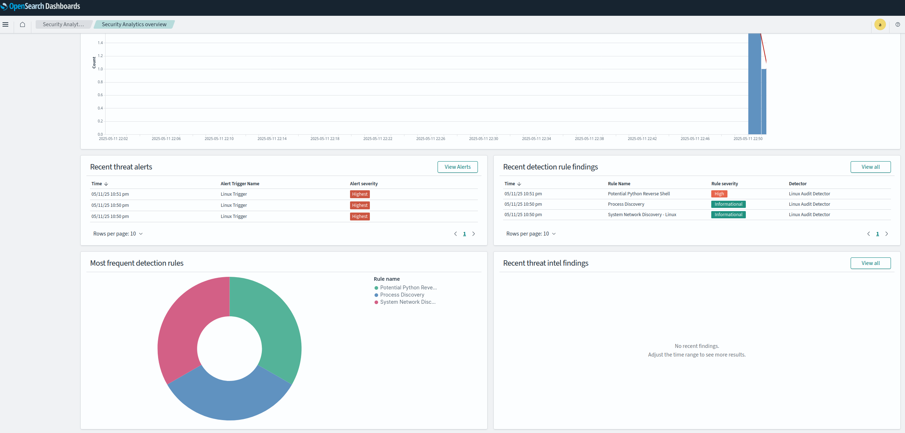

## Container Security Monitoring with OpenSearch

Github Repository for the OpenSearch Meetup in Vienna 


## Prerequisites

- Docker and Docker Compose
- Linux host (for Falco monitoring functionality)

## Quick Start

1. Clone this repository:
   ```bash
   git clone https://github.com/m-a-x-e-d/container-security-with-opensearch.git
   cd container-security-with-opensearch
   ```

2. Create a `.env` file with the following variables:
* Make sure you only change the Password, keep the rest as is (see `env.sample`).
   ```
    OPENSEARCH_USERNAME=admin
    OPENSEARCH_PASSWORD=<SECRET PASSWORD>
    OPENSEARCH_HOST=https://opensearch-node:9200
    DASHBOARDS_HOST=http://opensearch-dashboards:5601
   ```
* If you are in a rush just do:
   ```bash
   cp env.sample .env
   ```

3. Start the environment using the `start.sh` script:
   ```bash
   ./start.sh
   ```

4. Access OpenSearch Dashboards:
   ```
   http://localhost:5601
   ```
   Default credentials (if not changed in environment):
   - Username: `admin`
   - Password: value of `OPENSEARCH_PASSWORD` in your `.env` file

5. Shutting down OpenSearch and deleting all resources
   ```bash
   docker compose down --volumes
   ```

## Architecture

The solution consists of the following components:

- **Falco**: Monitors system calls on the host
- **Auditbeat**: Alertnative for monitoring system calls
- **Fluentd**: Receives Falco and Auditbeat events via Docker logging driver and forwards them to OpenSearch
- **OpenSearch**: Stores and indexes security event data
- **OpenSearch Dashboards**: Provides visualization and analysis capabilities
- **Init Containers**: One-time setup containers that creates necessary indices, dashboards, and detectory for security analytics

## Configuration

### Falco

Falco is configured via two main files:
- `./falco/falco.yaml`: General Falco configuration
- `./falco/falco_rules.yaml`: Detection rules

You can customize detection rules by modifying the `falco_rules.yaml` file.

### Fluentd

Fluentd configuration is in `./fluentd/fluent.conf`. It's set up to:
1. Receive Falco events via the Docker logging driver
2. Format and forward events to OpenSearch

### OpenSearch

The OpenSearch instance runs with a single node for simplicity. For production use, consider configuring a multi-node cluster.

Security features are enabled with basic authentication. The default admin password is set via the `OPENSEARCH_PASSWORD` environment variable.

### Dashboards & Index Patterns

Pre-configured dashboards and index patterns for both Falco events and Linux audit logs are automatically created by an init container on startup.


### Security Analytics 

Pre-configured Security Analytics Detector with some Linux Sigma rules automatically created by the init container on startup.


